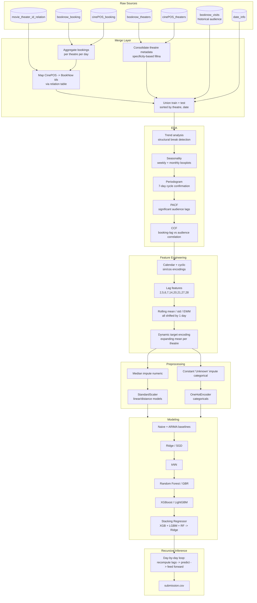
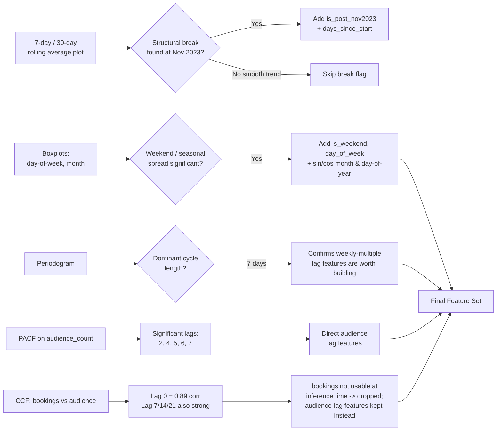
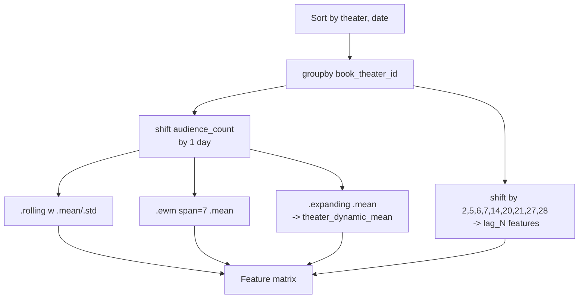
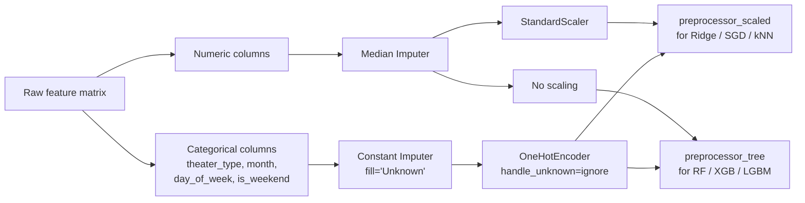
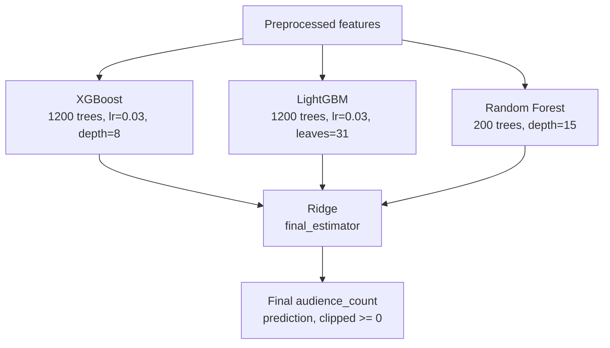

# Cinema Audience Demand Forecasting

**Predicting daily theatre-level audience counts from booking, POS, and calendar data using time-series feature engineering and a stacked ensemble.**

[](https://python.org)
[](https://scikit-learn.org)
[](https://xgboost.readthedocs.io)
[](https://lightgbm.readthedocs.io)
[]()

---

This project forecasts the **daily audience count** for individual cinema theatres, combining two disjoint data sources — **BookNow** (online advance bookings) and **CinePOS** (on-site ticket sales) — along with theatre metadata and a calendar table. It is framed as a **theatre × day panel regression / time-series forecasting** problem, submitted at the grain `ID = book_theater_id + show_date`.

The notebook walks through the full ML lifecycle: multi-source merging → structural/seasonal EDA → hypothesis-driven feature engineering (PACF/CCF-derived lags) → leakage-safe preprocessing → model bake-off (naive baselines → linear → boosting → stacked ensemble) → hyperparameter tuning → a **recursive autoregressive inference loop** for multi-day-ahead prediction.

---

## Table of Contents

- [Problem Framing](#problem-framing)
- [Data Sources](#data-sources)
- [End-to-End Pipeline](#end-to-end-pipeline)
- [Exploratory Data Analysis](#exploratory-data-analysis)
- [Feature Engineering](#feature-engineering)
- [Preprocessing Pipeline](#preprocessing-pipeline)
- [Modeling Approach](#modeling-approach)
- [Model Comparison](#model-comparison)
- [Final Model: Stacked Ensemble](#final-model-stacked-ensemble)
- [Recursive Forecasting Loop](#recursive-forecasting-loop)
- [Repository Structure](#repository-structure)
- [How to Run](#how-to-run)
- [Key Design Decisions (Interview Cheat Sheet)](#key-design-decisions-interview-cheat-sheet)
- [Possible Follow-Up Questions](#possible-follow-up-questions)

---

## Problem Framing

| Aspect | Detail |
| --- | --- |
| Target | `audience_count` — daily footfall per theatre |
| Grain | One row per `book_theater_id` × `show_date` |
| Submission ID | `book_theater_id + "_" + show_date` |
| Problem type | Panel/time-series regression (many short series, one per theatre, modeled globally) |
| Evaluation | R² and RMSE on a held-out **future** time window (no shuffling) |
| Core challenge | Two independently-keyed data sources, a structural break in the trend, strong weekly seasonality, and a test set that must be predicted **recursively** (future lag features depend on the model's own earlier predictions) |

---

## Data Sources

| File | Grain | Role |
| --- | --- | --- |
| `booknow_booking.csv` | booking-level, BookNow | Online advance ticket bookings |
| `cinePOS_booking.csv` | booking-level, CinePOS | On-site POS ticket sales |
| `booknow_theaters.csv` | theatre | BookNow theatre metadata (type, lat/lon, area) |
| `cinePOS_theaters.csv` | theatre | CinePOS theatre metadata |
| `booknow_visits.csv` | theatre × day | Historical daily audience counts (the training target history) |
| `date_info.csv` | day | Calendar / holiday information |
| `movie_theater_id_relation.csv` | mapping | `cine_theater_id` ↔ `book_theater_id` join key |

Because BookNow and CinePOS assign **different IDs to the same physical theatre**, `movie_theater_id_relation.csv` is the join key that stitches the two systems together before any modeling can happen.

---

## End-to-End Pipeline



---

## Exploratory Data Analysis

EDA in this notebook is deliberately **decision-driven** — every plot ends with a "→ Decision" that feeds directly into the feature list. The chain of reasoning:



**Key findings and why they matter (interview-ready):**

1. **Structural break (Nov 2023):** The raw series is flat/stable for most of 2023, then jumps to a permanently higher baseline. A 30-day average reacts too slowly to this — it motivated a binary `is_post_nov2023` flag plus a `days_since_start` trend feature, rather than relying purely on long rolling windows.
2. **Weekly seasonality dominates:** Boxplots and a periodogram both confirm a 7-day cycle is the single strongest periodic signal in the data — stronger than monthly/annual effects. This justifies lag features built on multiples of 7 (7, 14, 21, 28).
3. **PACF vs. CCF — a subtle but important distinction:** PACF on `audience_count` shows which of its *own* past values matter (lags 2, 5, 6, 7). But the goal was to find which *booking* lags best predict *audience*. That required a **Cross-Correlation Function (CCF)** against the target, not a PACF against bookings — PACF answers "does bookings depend on its own past," CCF answers "does audience depend on past bookings." This is a good one to explain clearly if asked.
4. **Booking-derived features were ultimately dropped from the final model** — bookings aren't known for the future test window at inference time in the same way audience history is, so the winning feature set leans on **audience self-lags + rolling stats + a dynamic target encoding**, not raw booking counts.

---

## Feature Engineering

All time-dependent features are computed **per theatre** (`groupby('book_theater_id')`) after sorting by `(book_theater_id, show_date)` — critical to avoid leaking one theatre's history into another's lag/rolling calculations.

| Feature Group | Features | Why (from EDA) |
| --- | --- | --- |
| Structural break | `is_post_nov2023` | Flags the new, higher-baseline regime |
| Global trend | `days_since_start` | Lets tree models learn gradual drift |
| Weekly cycle | `day_of_week`, `is_weekend` | Captures the dominant 7-day cycle |
| Calendar | `day_of_month`, `day_of_year`, `week_of_year`, `month` | Granular seasonality |
| Cyclical encoding | `sin_day_of_year`, `cos_day_of_year`, `sin_month`, `cos_month` | Makes Dec 31 "close to" Jan 1 numerically |
| Recent trend | `ewm_7_lag1`, `roll_mean_3/5/7_lag1` | Adapts quickly to shifts (EDA: slow averages miss the break) |
| Audience lags (short) | `lag_2`, `lag_5`, `lag_6`, `lag_7` | Direct PACF-significant lags |
| Audience lags (long) | `lag_14`, `lag_20`, `lag_21`, `lag_27`, `lag_28` | 7-day-multiple echoes from the periodogram |
| Volatility | `roll_std_7/14/28_lag1` | Distinguishes stable vs. "hit-driven" theatres |
| Monthly baseline | `roll_mean_14/28_lag1` | Stable underlying popularity level |
| Dynamic target encoding | `theater_dynamic_mean` | Expanding (leak-free) per-theatre mean, filled with global train mean for new theatres |

**All rolling/EWM/lag features are shifted by at least one day (`shift(1)` before `.rolling()/.ewm()`)** so that the feature for day *t* never uses day *t*'s own value — the single most important leakage guard in the whole notebook.



---

## Preprocessing Pipeline

Two parallel `ColumnTransformer` pipelines are built, because tree-based and distance/linear models need different treatment:



**Why median, not mean?** `audience_count` and related numerics have blockbuster-weekend outliers; the median is robust to them.

**Why `'Unknown'`, not the mode, for missing categoricals?** Missing theatre metadata is suspected to be **MNAR** (Missing Not At Random) — e.g., small pop-up theatres — so imputing with the mode would blend a real signal into the majority class. An explicit `'Unknown'` category lets tree models learn a distinct pattern for it instead.

**Time-based split, never shuffled:** validation is a genuinely future time window relative to training, matching how the model will actually be used at inference.

---

## Modeling Approach

A progressively more sophisticated bake-off, each rung benchmarked before moving to the next:

```mermaid
flowchart LR
    A[Naive baselines\nLag-7 / Rolling-mean-14] --> B[ARIMA\nper-theatre, statistical]
    B --> C[Linear models\nRidge, SGD]
    C --> D[Non-linear\nkNN]
    D --> E[Tree ensembles\nRandom Forest, Gradient Boosting]
    E --> F[Gradient boosting\nXGBoost, LightGBM]
    F --> G[Hyperparameter tuning\nRandomizedSearchCV + TimeSeriesSplit]
    G --> H[Stacking Regressor\nXGB + LGBM + RF -> Ridge meta-learner]
    H --> I[Recursive autoregressive\ninference loop]
```



**Why ARIMA was tried and set aside:** it modeled individual theatres reasonably well but requires **one model per theatre** — computationally expensive and doesn't share information across theatres. The ML models instead learn a **single global model** across all theatres, using theatre-level features (type, dynamic mean, lat/lon) to differentiate behavior, which generalizes better and scales to hundreds of theatres with one fit.

---

## Model Comparison

Validation performance (time-based holdout, not shuffled):

| Model | Validation R² | RMSE |
| --- | --- | --- |
| **Random Forest (default)** | **0.5806** | **19.87** |
| XGBoost (default) | 0.5775 | 19.95 |
| XGBoost (tuned) | 0.5791 | 19.91 |
| LightGBM (default) | 0.5661 | 20.21 |
| LightGBM (tuned) | 0.5714 | 20.09 |
| Random Forest (tuned) | 0.5745 | 20.02 |
| Gradient Boosting | 0.5503 | 20.58 |
| SGD Regressor | 0.5139 | 21.39 |
| kNN | 0.5073 | 21.54 |
| Ridge Regression | 0.4502 | 22.75 |
| Rolling Mean (14-day, naive) | 0.4496 | 22.77 |
| Naive (Lag-7) | 0.1764 | 27.85 |

**A notable, interview-worthy result:** hyperparameter tuning (RandomizedSearchCV + `TimeSeriesSplit`) did **not** beat the untuned default Random Forest. This is discussed explicitly in the notebook as evidence that the *default* parameters were already well-suited to this dataset, and that further tuning risked overfitting a search grid to a single validation fold rather than genuinely improving generalization. The final production model moves past single-model comparison into a **stacking ensemble** to combine the complementary strengths of RF (variance reduction via bagging), XGBoost/LightGBM (bias reduction via boosting), and a linear meta-learner.

---

## Final Model: Stacked Ensemble



- **Base learners:** XGBoost, LightGBM, and Random Forest — chosen for diversity (two boosting variants with different tree-growth strategies, plus one bagging ensemble) rather than three near-identical models.
- **Meta-learner:** a plain `Ridge` regressor, trained via 5-fold CV (`StackingRegressor(cv=5)`) on the out-of-fold predictions of the base learners — this avoids the meta-learner overfitting to in-sample base-model predictions.
- **`passthrough=False`:** the meta-learner sees only the three base predictions, not the raw features — keeping the meta-learner simple and interpretable.
- Predictions are **clipped at 0** (`np.maximum(preds, 0)`) and rounded, since audience count can't be negative.

---

## Recursive Forecasting Loop

The trickiest engineering piece: at inference time, features like `lag_2`, `roll_mean_7_lag1`, and `theater_dynamic_mean` for a **future** date depend on audience counts that haven't been observed yet — including counts the model itself is about to predict for *earlier* days in the test window. This is solved with a day-by-day autoregressive loop:

```mermaid
sequenceDiagram
    autonumber
    participant Loop as Prediction Loop
    participant FE as create_dynamic_features()
    participant Model as Trained Stacking Pipeline
    participant Store as live_df (shared state)

    Note over Store: live_df starts as train + test,\ntest audience_count = NaN

    loop for each future show_date, in order
        Loop->>FE: recompute lags/rolling/EWM/dynamic mean\nover the ENTIRE live_df
        FE-->>Store: refreshed features for today's rows
        Loop->>Store: select today's feature rows
        Loop->>Loop: impute any leftover NaNs\nwith training medians (new theatres)
        Loop->>Model: predict(X_today)
        Model-->>Loop: audience_count predictions
        Loop->>Store: write predictions back into\nlive_df[today, audience_count]
        Note over Store: tomorrow's lag_1/lag_2/etc.\nwill read these written-back values
    end

    Loop->>Loop: build submission.csv\nID = book_theater_id + show_date
```

This is a classic **recursive multi-step forecasting** pattern: each day's prediction becomes an input feature for the next day's prediction, so a single systematic error early in the test window can compound — a good discussion point on forecast error accumulation and why validation R² on a single-step holdout can overstate real multi-day forecasting accuracy.

---

## Repository Structure

```
Cinema-Audience-Demand-Forecasting/
├── 23f301889-notebook-t32025.ipynb          # Main/final notebook (EDA -> modeling -> submission)
└── 23f3001889-notebook-t32025 (19).ipynb    # Earlier iteration of the same pipeline
```

> The repository currently consists of the analysis notebooks only (no separate `src/`, `data/`, or `requirements.txt`). Raw CSVs are read from a Kaggle input path (`/kaggle/input/Cinema_Audience_Forecasting_challenge/...`) — see [How to Run](#how-to-run) for adapting this to a local environment.

---

## How to Run

```bash
# 1. Clone the repo
git clone https://github.com/archi829/Cinema-Audience-Demand-Forecasting.git
cd Cinema-Audience-Demand-Forecasting

# 2. Install dependencies
pip install pandas numpy matplotlib seaborn plotly scipy statsmodels \
            scikit-learn xgboost lightgbm jupyter

# 3. Point the data-loading cell at your local CSVs
#    (replace the /kaggle/input/... paths with a local ./data/ folder
#    containing: booknow_booking.csv, cinePOS_booking.csv,
#    booknow_theaters.csv, cinePOS_theaters.csv, booknow_visits.csv,
#    date_info.csv, movie_theater_id_relation.csv, test.csv)

# 4. Run the notebook top to bottom
jupyter notebook "23f301889-notebook-t32025.ipynb"
```

The notebook writes `submission.csv` at the end (`ID`, `audience_count`), matching the competition's required format.

---

## Key Design Decisions (Interview Cheat Sheet)

| Decision | Rationale |
| --- | --- |
| Sort by `(theatre, date)` before any lag/rolling op | Prevents cross-theatre leakage in `groupby` time-series features |
| All rolling/EWM/expanding stats shifted by 1 day | Prevents same-day target leakage (feature must never see the label it's predicting) |
| Time-based split, `TimeSeriesSplit` for CV | Simulates real deployment — you never train on the future to predict the past |
| Median imputation (numeric) | Robust to blockbuster-weekend outliers vs. mean |
| `'Unknown'` category (not mode) for missing metadata | Missing-ness is informative (MNAR), not random |
| Dynamic (expanding) target encoding instead of static theatre mean | Adapts to the Nov-2023 structural break without leaking future data |
| CCF over PACF for booking→audience lag selection | PACF only measures a series' relationship with its own past; CCF measures cross-series predictive lags |
| Global model over per-theatre ARIMA | One fit scales across all theatres and shares cross-theatre signal; ARIMA doesn't |
| Stacking (XGB + LGBM + RF → Ridge) over the single best model | Combines boosting's bias reduction with bagging's variance reduction; meta-learner blends them optimally |
| Recursive day-by-day inference loop | Required because future-date lag features depend on the model's own earlier predictions |
| Predictions clipped at 0 | Audience count is a non-negative count variable |

---


---

**Cinema Audience Demand Forecasting** — a time-series regression case study in leakage-safe feature engineering and recursive multi-step inference.
